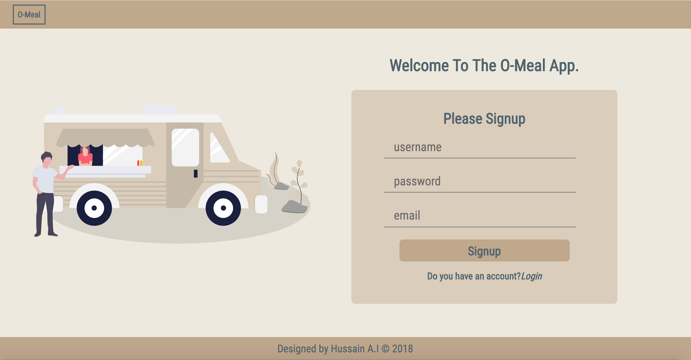

# orderMeal-in-React-Redux
OrderMeal is a food delivery service app for a restaurant. This repo implements the front-end version of the app using React/Redux.

## Screenshot

## Features:
- User can signup/register on the application
- Users can login to the app

## TECHNOLOGIES
The front-end was implemented using:
* [HTML](https://www.w3schools.com/Html/) A standard markup language for creating Web pages
* [CSS](https://www.w3schools.com/css/css_intro.asp) This describes how HTML elements are to be displayed on screen.
* [React](https://reactjs.org/) A JavaScript library for building user interfaces.
* [Redux](https://redux.js.org/) A predictable state container for JavaScript apps.

## INSTALLATION
 * install [Node js](https://nodejs.org/en/)
 * Clone the repository `git clone https://github.com/Daymorelah/orderMeal-in-React.git` 
 * `CD` into the project directory
 * Run `yarn install` to install dependencies
 * Run `yarn start` to get the app started on your local machine.
 * type `http://localhost:3000/signup` into your browser URL.
 
## TESTING
To run tests:
* `CD` into the project directory
* Run `yarn test` to run tests on the app

#### To view the app on Heroku click [here](https://omeal.herokuapp.com/singup)

## Contributing
* Fork this repository
* Clone to your local machine: https://github.com/Daymorelah/orderMeal-in-React-Redux.git
* Create your feature branch: git checkout -b ft-my-new-feature
* Commit your changes: git commit -am 'Add some feature'
* Write test for the new features
* Push to the branch on GitHub: git push origin ft-my-new-feature-2178134
* Submit a pull request against the development branch

### Author
* Ademola Hussain

### Licence
[MIT License](https://github.com/Daymorelah/orderMeal-in-React-Redux/blob/master/LICENSE)
 
